Pro2 to AMB82 mini adaptor board 
========================================

.. contents::
  :local:
  :depth: 2

AmebaPro2 Architecture for Camera with VOE Flow
---------
AmebaPro2 supports two ways of starting up a camera sensor.

Normal Mode
~~~~~~~~~~~~~~~~~~~~~~
|image01|

Fast Camera Start(FCS) Mode
~~~~~~~~~~~~~~~~~~~~~~
|image02|

Sensor Configuration on AmebaPro2 
---------
AmebaPro2 uses a set concept for sensor and image quality control.

|image03|

Each set contains an optional fast camera start driver, an IQ configuration and a normal camera driver. It is essential to have the last two configurations for the camera to start up. 
The configuration files are automatically used during the first "Make" project stage, so a clean build of the entire project may be needed when updating the binary files (FCS driver, IQ, normal driver).

For the sensor AVL supported by AmebaPro2, users can check "{SDK}/project/realtek_amebapro2_v0_example/inc/sensor.h" for more details. The resolution and FPS supported by each sensor can be found here.

|image04|

In the same "sensor.h", users can customize the sensors used and which configuration files to pair with the specific sensor chosen.
"SENSOR_MAX" can be set up to a maximum of 9 with an additional dummy set that can be omitted. The user has to define the specific driver index to be used. Then select whether to enable FCS mode for start up and which IQ configuration is to be used.
It is best to follow the naming rule that is, for example the GC20253 camera sensor will have the normal driver named as "sensor_gc2053.bin". Its corresponding FCS driver is "fcs_data_gc2053.bin" and its IQ will be "iq_gc2053.bin". If the IQ binary cannot be found, the default "iq.bin" will be used instead.

|image05|

Driver file location
~~~~~~~~~~~~~~~~~~~~~~
The path to the camera sensor driver binary files can all be found in -"{SDK}/component/soc/8735b/fwlib/rtl8735b/lib/source/ram/video/voe_bin".
This is where users should put the camera sensor drivers in after creating them, then do a clean build afterwards. AT commands can be used to verify the version of drivers used by sending "ATII=version".

|image06|

|image07|

Users should also ensure that driver version and SDK version are either the same or compatible. Users can check ((((insert link to sensor driver)))) for the latest sensor driver environments.
Some examples of output logs for version check:

Log when applying ISP

|image08|

Log when using command

|image09|

How to Add Sensor Drivers
---------

Normal Driver
~~~~~~~~~~~~~~~~~~~~~~
Download the VOE code base version that is compatible with the SDK used.
Add a new sensor driver if needed, please refer to ((((insert link)))) for more information.
Output the sensor driver bin and VOE bin then copy the necessary binary files into the "voe_bin" folder in the SDK.

|image10|

Let's take sc2333 for example. First, copy and rename a folder from the same vendor to sc2333. Open the sensor driver folder and replace the sensor name with sc2333.
Next, we need to modify the configuration for the VOE code base in "source/sensor/Makefile"

|image11|

|image12|

Finally, compile and check the output bin, it should now have the normal driver file named "sensor_sc2333.bin". Further details on how to edit the driver parameters can be found in another guide here ((insert link to part 2))

FCS Driver
~~~~~~~~~~~~~~~~~~~~~~
Use the following command to output FCS driver,

.. code-block:: bash
    gcc -o fcs_g.exe gen_fcs_data.c
    ./fcs_g.exe

The output should look like this. 

|image13|

An example using sc2333 looks like this,

|image14|

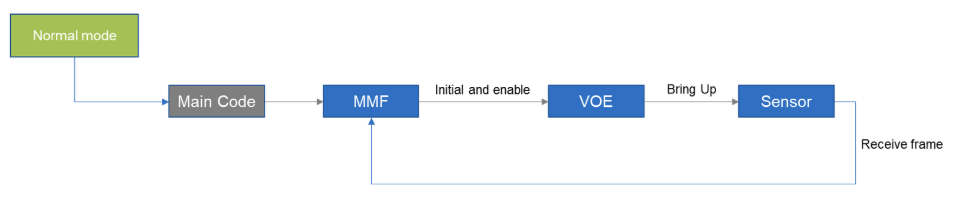

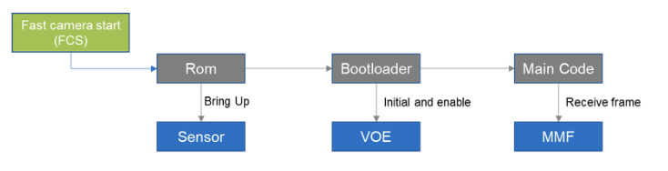

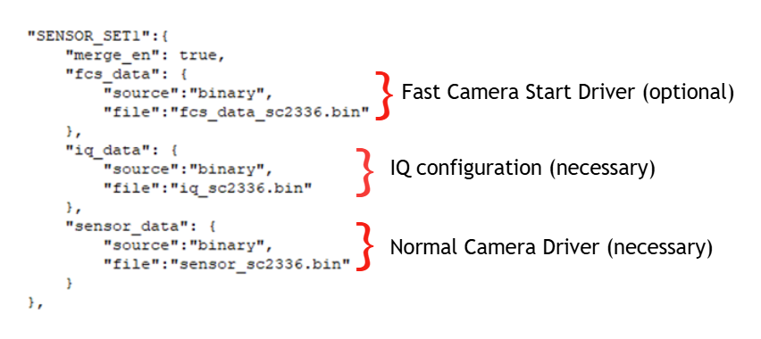

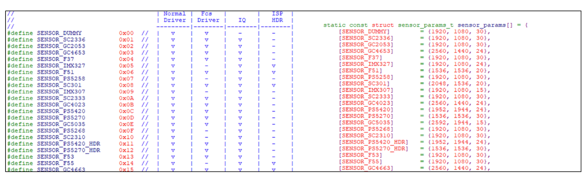

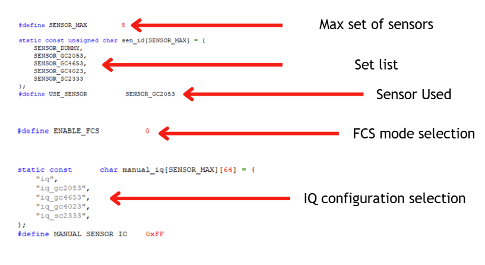

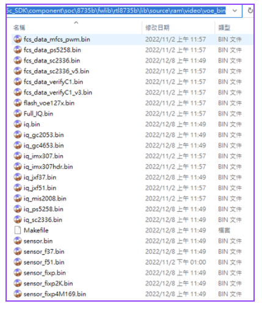

.. |image07| image:: ../../../_static/images/introflow/versioncheck.jpg

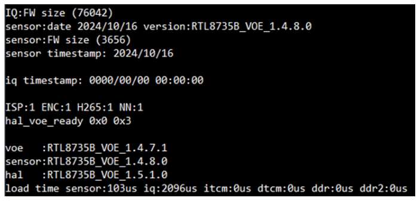

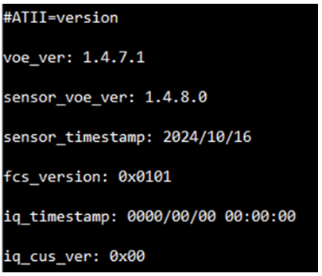

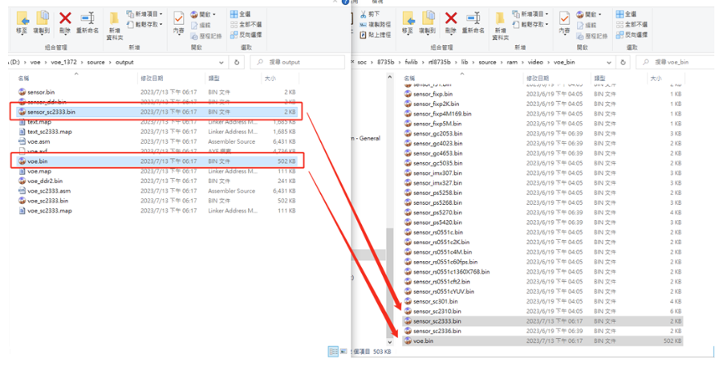

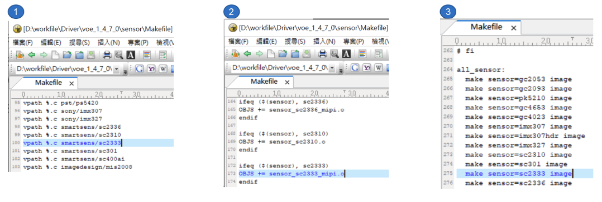

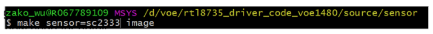

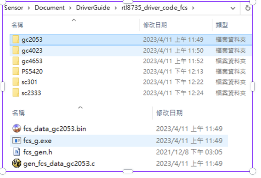

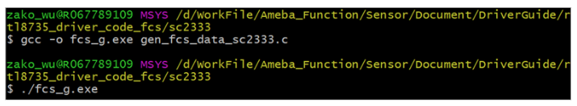

