AmebaPro2 Introduction to Porting Sensor Driver
========================================

.. contents::
  :local:
  :depth: 2

General Sensor Start Up Flow
---------
|image01|

AmebaPro2 Driver Architecture
---------
* Architecture (Take sc2333 for example)
    * rts_isp_sensor_ops sc2333_ops
        * Function pointer arrangement for each sensor driver
    * sc2333_get_info
        * General function for power on / power off sequence with i2c setting
    * sc2333_get_init_info
        * General function for RX configuration (mipi ,window setting)
    * sc2333_get_tuned_again
        * General function to set sensor analog gain
    * sc2333_get_tuned_dgain
        * No use in amebapro2
    * sc2333_get_exposure_gain_info
        * Auto exposure function
    * sc2333_set_mirror_flip
        * Function for Sensor orientation
    * sc2333_check
        * Function to check sensor ID

Function List
---------

fps_info_asic
~~~~~~~~~~~~~~~~~~~~~~
User needs to set the RX information based on the initial setting provided by the vendor or datasheet. Using Sc2333 as an example, the total MIPI clock is 742.5M and its pixel clock is 74.25M.

|image02|

AmebaPro2 needs to set the following 3 parameters for RX which are Max FPS, Line Length and Pixel Clock.

|image03|

A method that can be used to calculate the Line Length is,

|image04|

get_info
~~~~~~~~~~~~~~~~~~~~~~

|image05|

For the power on/off function, there are 4 parameters to be used as seen in set_power_item(index, GPIO, value, delay). The index is cascaded one by one. GPIO can be reset, power down or system clock. Value is either high or low if the parameter before is GPIO or the clock's frequency if it was system clock. The final delay parameter represent the amount of time in microseconds to delay after the function.
|image06|

get_init_info
~~~~~~~~~~~~~~~~~~~~~~
|image07|

get_tuned_again
~~~~~~~~~~~~~~~~~~~~~~
|image08|

get_exposure_gain_info
~~~~~~~~~~~~~~~~~~~~~~
|image09|

set_mirror_flip
~~~~~~~~~~~~~~~~~~~~~~
|image10|

sc2333_check
~~~~~~~~~~~~~~~~~~~~~~
In this function, it is important to change to the name of the camera sensor that is being used and ensure that the id matches the sensor's.

|image11|

Debug Flow
---------
* Check Driver Bin
    * By debug log
* Check Power on sequence
    * Check sensor id register through i2c
* Check Mipi RX
    * Here is the register from ISP for receiving information
    * Check MIPI frame/line/pixel
        * Read MIPI_DPHY_FRAME_CNT (0x403C_0198)
        * Read MIPI_DPHY_LINE_CNT (0x403C_019C)
        * Read MIPI_DPHY_PXI_CNT (0x403C_01A0)
    * Check Input frame count
        * Read SYS_FRAME_CNT(0x4030_0020)
    * Check Isp pipeline status
        * Read SYS_FRAME_IDLE (0x4030_0028)
    * Example: using Atcmd for check these information
        * ATIX=read32,address offset, length
            * Address base is 0x40000000
        * ATIX=read32,0xc0198,3

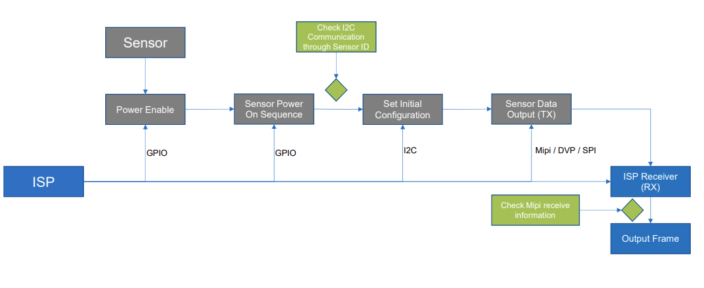

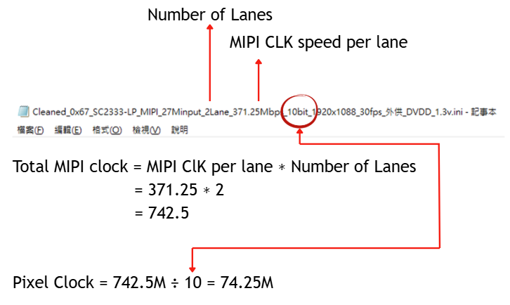

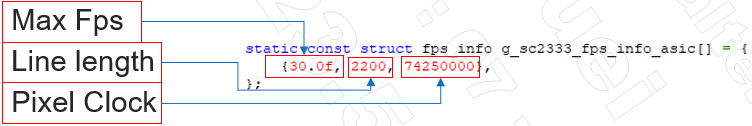

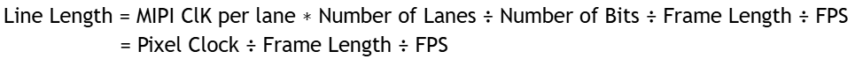

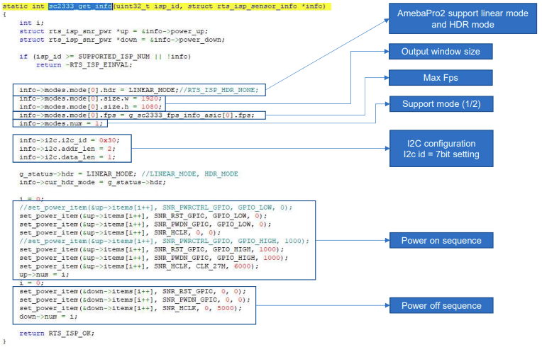

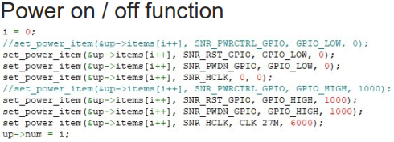

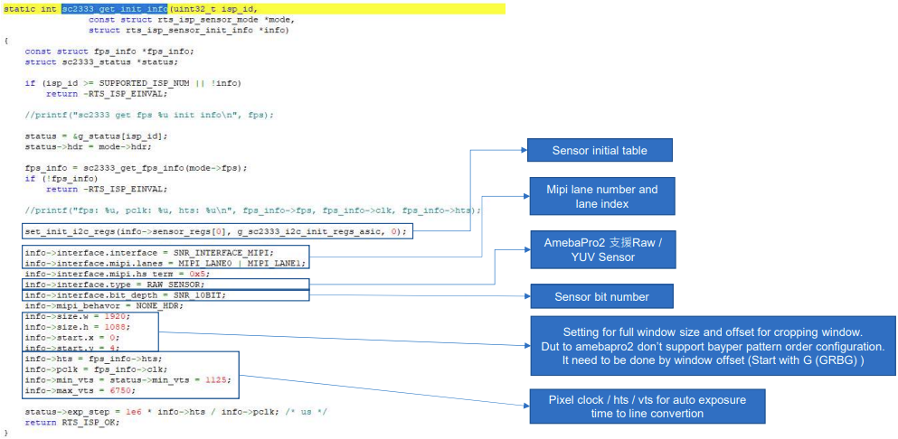

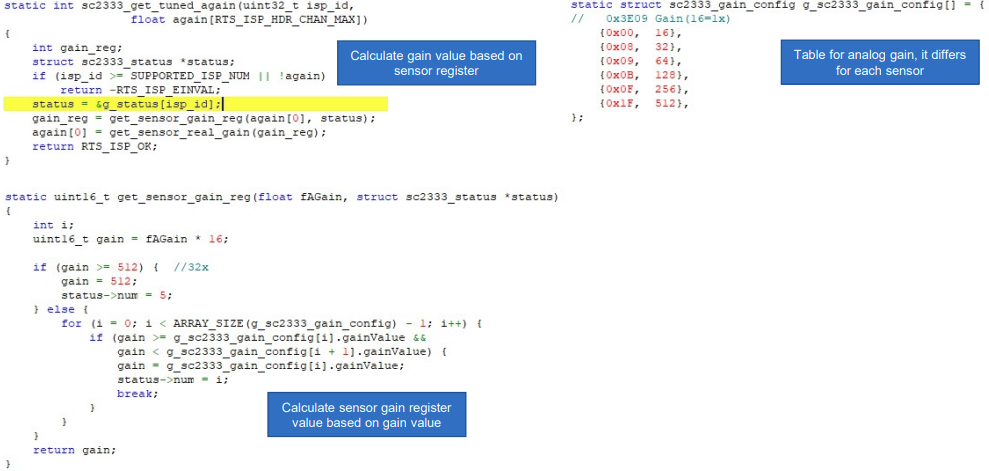

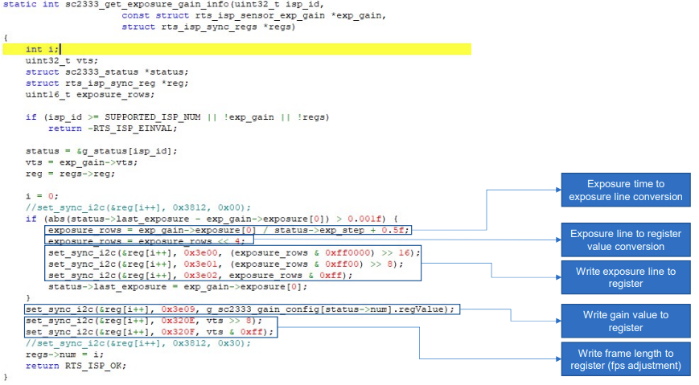

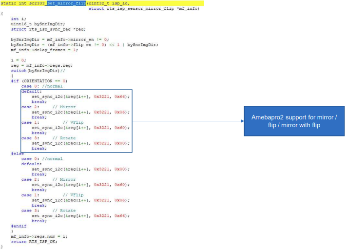

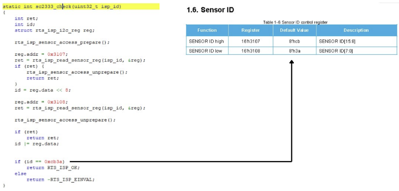
