Introduction to Camera Sensor Start Up Flow
========================================

.. contents::
  :local:
  :depth: 2

General Sensor Start Up Flow
---------
|image01|

Users will need to ensure that they have the following documents from the vendor before getting started:
* Sensor Specifications
* Initial Configuration
* Application Note
* Module Design Guide
* Sensor Board

Sensor Power On Sequence 
---------

First, begin with the power on sequence for the start up flow. Check the sensor's specifications for the following information. (Using GC2053 as an example)

* Power Domain (Check sensor AVDD / DVDD / DOVDD)
  |image02|

* Power On Sequence
    #. Enable Power
    #. Set GPIO to control Reset and PWDN Pin
    #. Set MCLK (Refer to the initial table)
    #. Write sensor's initial setting (via I2C)

  |image03|

* Check that the Power On Sequence is ready using I2C communication through the Sensor ID.

Example of the sensor specifications:

* MCLK - typically set at 24/27 MHz
  |image04|

* I2C
    * Slave Address
      |image05|

    * I2C prototype
        * Address length 2/1 byte
        * Data length 2/1 byte

* Sensor ID
  |image06| 

Set Initial Configuration
---------

This initial configuration should be obtained from the sensor vendor and it should contain some key information of the camera sensor as shown below

|image07|

Set ISP RX Configuration
---------

Please note that the AmebaPro2 only supports the MIPI interface. Some details about the camera sensor that you will need before configuring the RX configuration are:

* Number of MIPI lanes
* Number of bits per pixel
* MIPI clock speed per lane
* Frame rate (FPS)
* Frame length (VTS) and Line length (HTS)
* Pixel clock speed

Now verify that the RX configuration is ready by checking the MIPI debug register for information on the Frame Count, Line Count and Pixel Count. 
The AT command to check for this is

.. code-block:: bash

    ATII=info,mipi

The resulting counts from each of the three registers should be non-zero. For example,

.. code-block:: bash

    frame_cnt: 0x000000EE (238)
    pixel_cnt: 0x000001FB (507)
    line_cnt: 0x00000788 (1928)

Now the AmebaPro2 should be receiving the images from the camera, but the colors may be off. If that is the case, you should try to adjust the bayer pattern order for alignment between the sensor and the ISP. (RGGB / GRBG / GBRB / BGGR)
Taking the GC2053 and Pan Tilt Configuration for example, the general window size is 1920 * 1080. However, it is suggested to get the initial setting for at least 4 for H and V, that is to get a 1924 * 1084 or 1928 * 1088 window configuration.

|image15|

Finally, the last three items to be configured in the sensor driver are:

* Auto Exposure Time Configuration
    Check sensor register on how to set the exposure time to the exposure line
* Auto Exposure Gain Configuration
    Check sensor register on how to set the sensor analog gain
* Orientation configuration
    Check the sensor register on how to re-orientate the image 

Debug Flow
---------

Check Sensor Power
~~~~~~~~~~~~~~~~~~~~~~
Understand the general power on sequence by checking the sensor datasheet.

Using GC3003 as an example,

|image08|

|image16|

|image09|

Users can assign sepcific GPIOs as sensor power control pin but do ensure that the HW and SW are aligned.

Some sensors have specific order for which power lines to be powered first.
    * Check the sequence of AVDD / DOVDD / DVDD
    * Check charging time for each power if using RC instead of LDO or DCDC
    * Check the power conditions for power lines
      |image10|

Check Reset Flow
~~~~~~~~~~~~~~~~~~~~~~
Check the RST, PWDN and MCLK pins. These three pins have specific uses and cannot be modified.

|image11|

The AmebaPro2 only supports a 3.3V for sensor gpio. If the sensor cannot support a 3.3V input, a level shift is needed to adjust the voltage between sensor and controller.
Ensure the correct voltage levels on the three pins and that the MCLK should be at 24M or 27M.

Check I2C Status
~~~~~~~~~~~~~~~~~~~~~~
The AmebaPro2 only supports a 3.3V for sensor gpio. If the sensor cannot support a 3.3V input, a level shift is needed to adjust the voltage between sensor and controller.
Some sensors support dual I2C slave address so for the general sensor driver it is recommended to use the default ID. Otherwise, a new sensor driver has to be generated to use the other slave address.

|image12|

|image13|

|image14|

Check ISP RX Configuration
~~~~~~~~~~~~~~~~~~~~~~
In general, once the sensor starts up successfully and the ISP is receiving image from the sensor and it will output the frames.

Where could it go wrong?

* In some special cases, the ISP may not receive the image due to:
    * Distance between sensor and controller is too long
    * MIPI TX and RX configurations is/are wrong (eg. data lane 0 (TX) -> data lane 1 (RX))

* Use the follow commands to check status
    * ATII=fps,show (check for consistent frame output from each channel)
    * ATII=info,mipi (check the ISP MIPI RX status and frame count)

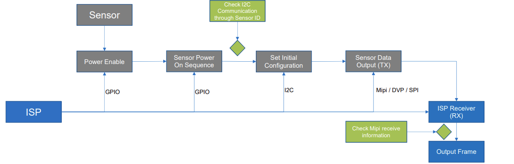

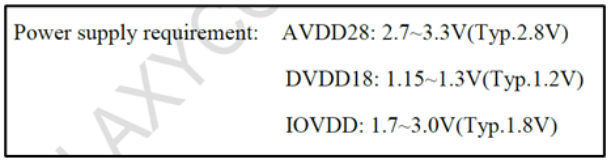

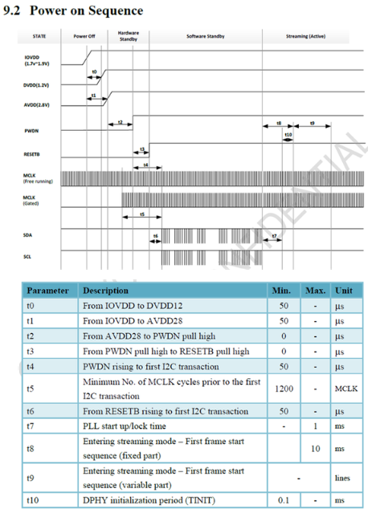

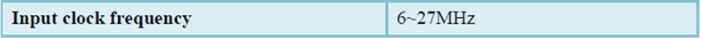

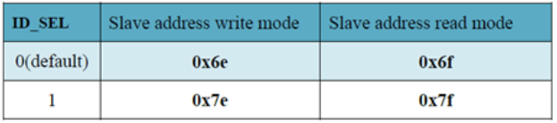

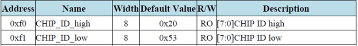

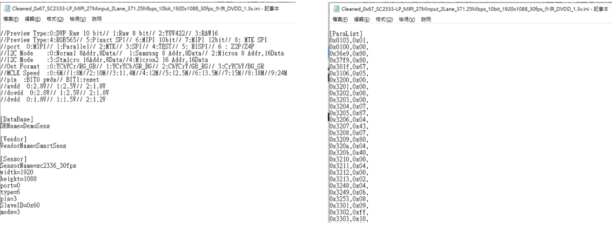

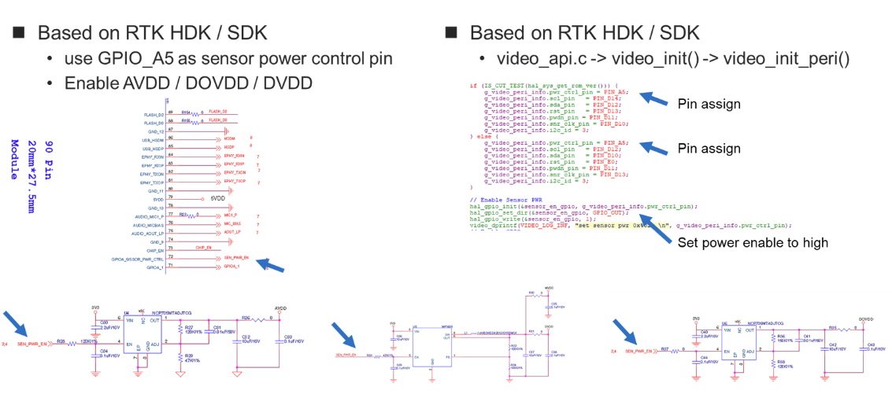

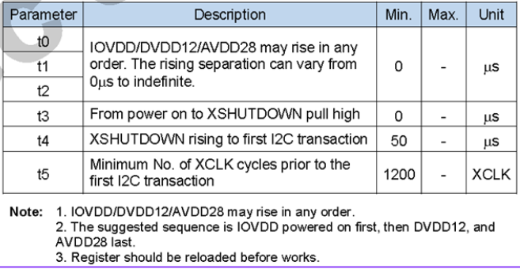

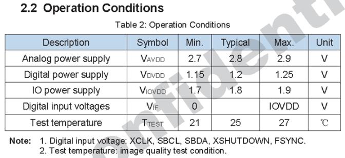

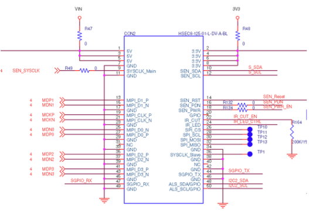

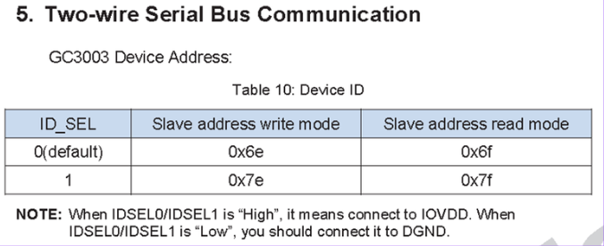

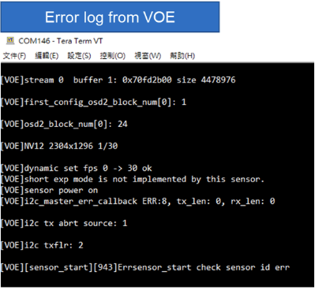

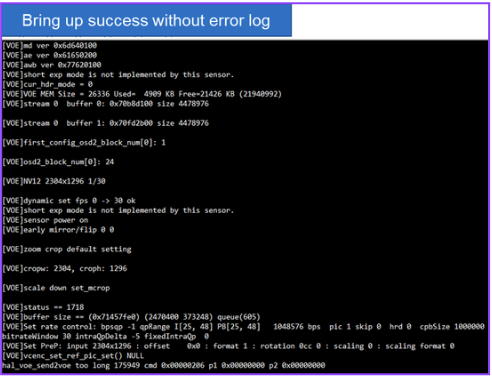

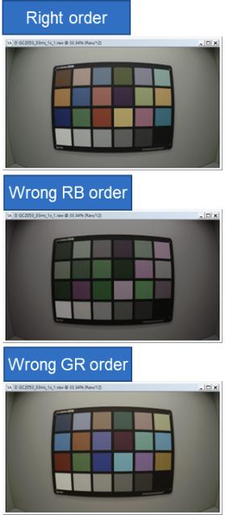

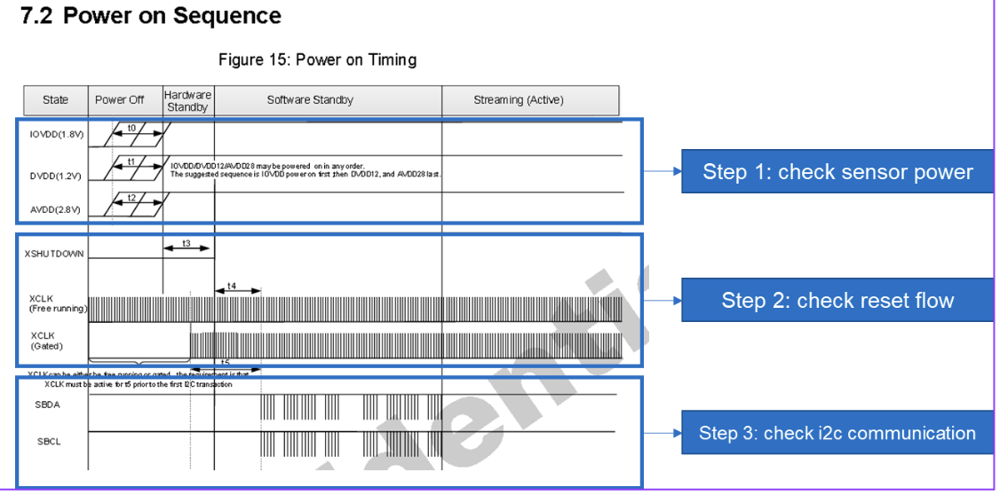

