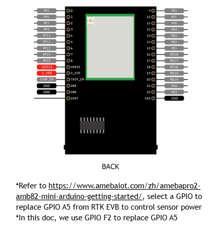
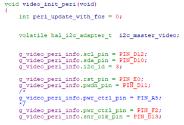
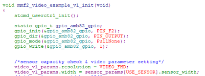

Pro2 to AMB82 mini adaptor board 
========================================

.. contents::
  :local:
  :depth: 2

Adapter Board Information
---------
|image01|

|image02| <https://ameba-doc-arduino-sdk.readthedocs-hosted.com/en/latest/ameba_pro2/amb82-mini/Getting_Started/Getting%20Started%20with%20Ameba.html>

Connecting the AMB82-Mini to the Adapter Board
---------
|image03|

Modifying SDK for sensor control
---------
In order to use the adapter board, we must also ensure the PWR_EN input pin is set to high by connecting it to a GPIO output pin on the AMB82-Mini. This can be done using the one of the following two methods.

Method 1
~~~~~~~~~~~~~~~~~~~~~~
Modify the function "video_init_peri()" in "{SDK}/component/video/driver/RTL8735B/video_api.c".

.. code-block:: c

/*
g_video_peri_info.pwr_ctrl_pin = PIN_A5;
*/
g_video_peri_info.pwr_ctrl_pin = PIN_F2;

.. note :: Comment out PIN_A5 and use PIN_F2 instead

|image04|

Method 2
~~~~~~~~~~~~~~~~~~~~~~

Add the GPIO control before the video opens.

.. code-block:: c

static gpio_t gpio_amb82_gpio;
gpio_init(&gpio_amb82_gpio, PIN_F2);
gpio_dir(&gpio_amb82_gpio, PIN_OUTPUT);
gpio_mode(&gpio_amb82_gpio, PullNone);
gpio_write(&gpio_amb82_gpio, 1);

For example in mmf2_video_example_v1, we can insert this block right after calling "atcmd_userctrl_init();".

|image05|

Modifying SDK for IR control
---------

If you are not using an ambient light sensor, you should comment out the following lines in the function "fATIR()" in "{SDK}/component/at_cmd/atcmd_isp.c".
This is to avoid any I2C errors when using AT commands or function calls to control the IR.

.. code-block:: c

// ambient_light_sensor_init(NULL);
// ambient_light_sensor_power(1);

AT commands for IR control
~~~~~~~~~~~~~~~~~~~~~~
ATIR=init_ir
ATIR=init_led
ATIR=set_ir_cut,0/1   (0 = remove IR cut, 1 = enable IR cut)
ATIR=set_ir_led,0/100 (0 = disable IR LED, 100 = enable IR led with maximum brightness)

Functions for IR control
~~~~~~~~~~~~~~~~~~~~~~
The functions can be found in "{SDK}/component/media/framework/sensor_service.h".

An example of these functions being used can be found in the "function sensor_board_init()" from "{SDK}/project/realtek_amebapro2_v0_example/src/mmfv2_video_example
/video_example_media_framework.c". Before you can use this function in the video examples, you must change the following in "{SDK}/project/realtek_amebapro2_v0_example/inc/platform_opts.h"

.. code-block:: c

"#define CONFIG_RTK_EVB_IR_CTRL 2"

Similarly, do remember to comment out the functions related to the ambient light sensor.

.. |image01| image::  ../../../_static/adapterboard/adapterboardpins.jpg

:target: https://ameba-doc-arduino-sdk.readthedocs-hosted.com/en/latest/ameba_pro2/amb82-mini/Getting_Started/Getting%20Started%20with%20Ameba.html

.. |image03| image:: ../../../_static/adapterboard/adapterboardconnections.jpg

   
.. code-block:: bash

   export PATH=<PATH_TO_YOUR_TOOLCHAIN>/asdk-10.3.0/linux/newlib/bin:$PATH

.. note :: You can add PATH to ~/.bash_profile

